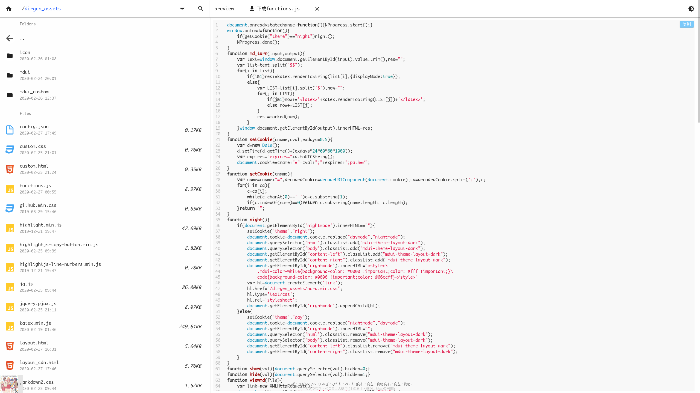
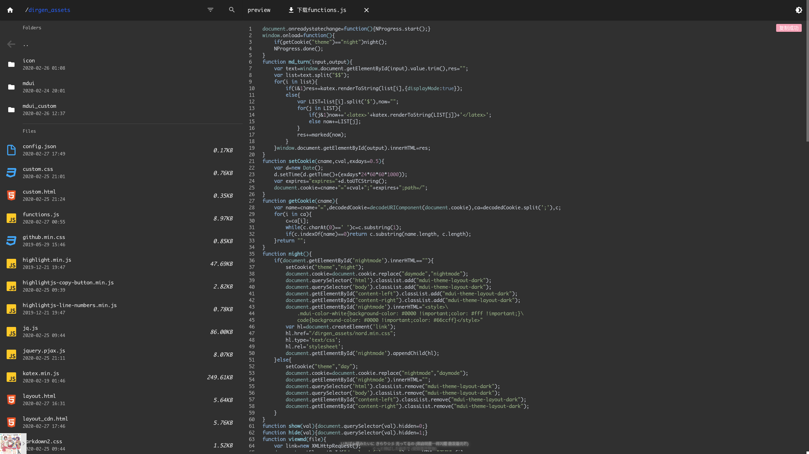

## 简介

 一个**美观**的供**静态网站**(如github pages)使用的**目录列表**程序,支持**搜索和预览**,支持代码和**markdown**的预览(支持**latex**)

使用python编写

[demo](https://www.zcmimi.top/f_index.html)

## 特点

-  **静态网页**,让静态网站也可以有文件床,服务器使用也可以减轻服务器压力
-  支持**markdown+latex**预览,采用marked.js+katex高速渲染
-  使用mdui,采用**material design**,简洁,美观
-  **轻量,纯javascript,pjax**,无刷新极速加载,让带宽低的网站也可以有优良的体验
-  支持目录加密
-  支持筛选和**搜索**(之后可能会加上借助外部搜索的支持)
-  夜间模式
-  加载进度条(nprogress)
-  自动识别当前目录中是否已有网站

## 初步使用

1. 将`dirgen.py,dirgen_assets`放置到根目录
2. 运行`dirgen.py`,在各个目录下生成`f_index.html`

## 自定义

1. 配置`dirgen_assets/config.json`: 

  - **站名**

     >  修改**`site_name`**

  - **搜索**

     > 考虑到这是静态网站,搜索文件采用生成文件来辅助搜索
     >
     >  请向**`search_typlist`**添加或删除要支持搜索的文件后缀
     >
     >  修改**`search_each_file_length`**来限制每个文件向辅助文件中添加文本的长度,以防止辅助文件过大,提高搜索时加载速度
     
  - htmlmin

     压缩页面源代码,提高加载速度

     修改`htmlmin`为`true`前请先`pip install htmlmin`

     推荐开启

     在本地调试时请关闭以提高页面源代码的可读性

  - 对需要加载的脚本使用cdn,加快访问速度

     这个功能是对访问速度慢的服务器设计的,如果你的服务器速度快就可以不考虑了

     修改`use_cdn`为`true`,使用cdn

2. 自定义css:  修改`dirgen_assets/custom.css`

3. 自定义html: 修改`dirgen_assets/custom.html`

4. 高级自定义: 修改`dirgen_assets/layout.html` warning: 核心文件,谨慎操作

## 加密目录

请在要加密的目录(不让外人查看)下新建文件`.passwd`,写入密码

## todo list

- [ ] 添加移动端支持
- [ ] 添加其他功能与调整
- [ ] 支持搜索api
- [ ] 添加其他主题

## 本项目使用到的其它项目:

1. [MDUI](https://github.com/zdhxiong/mdui)
2. [Marked](https://github.com/markedjs/marked)
3. [Katex](https://github.com/KaTeX/KaTeX)
4. [Pjax](https://github.com/MoOx/pjax)
